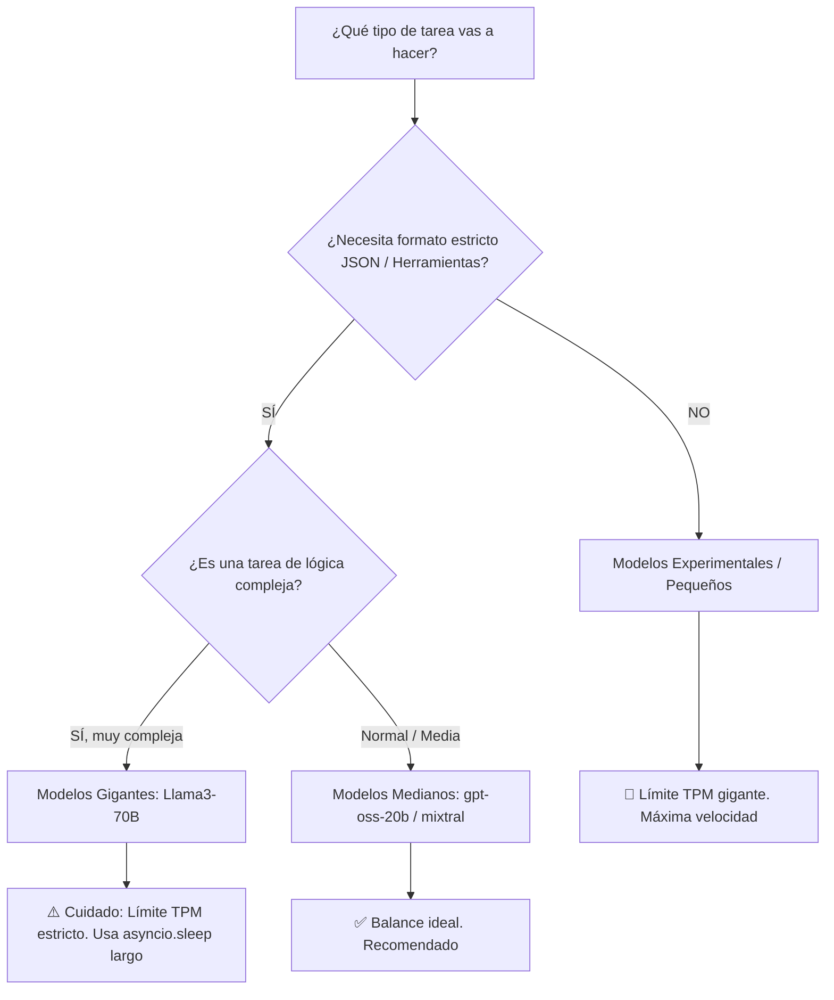
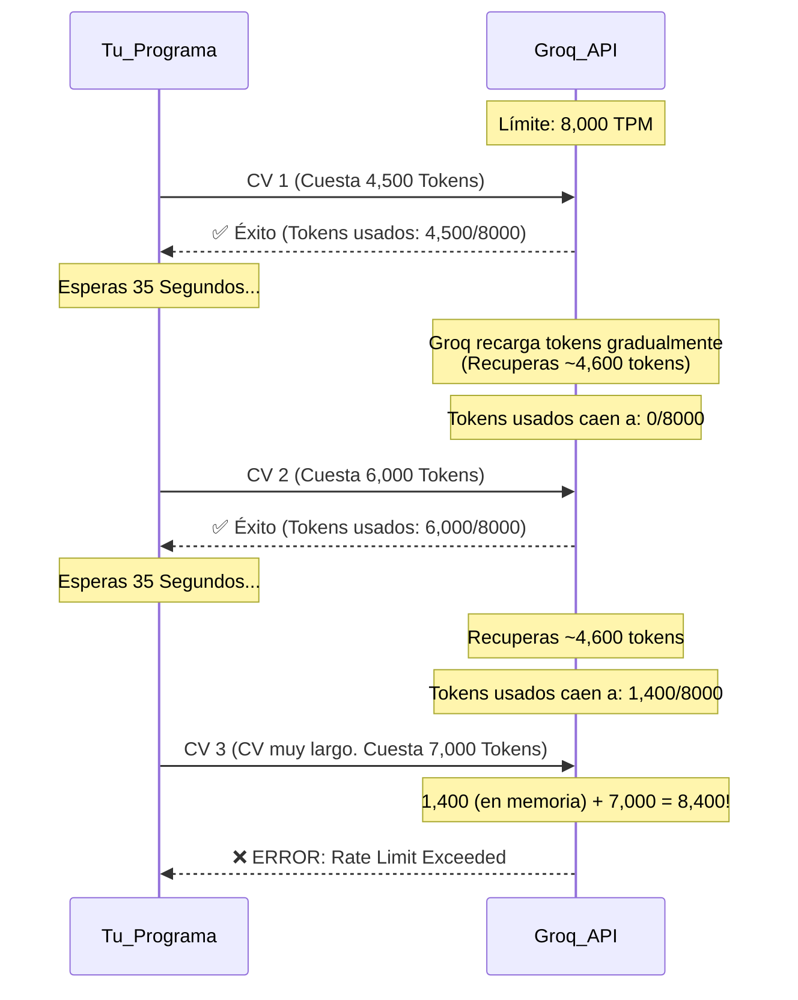

# Guía de Supervivencia: Selección de Modelos y Gestión de Límites (Rate Limits)

> [!NOTE]
> Esta guía resume todo lo que hemos aprendido hoy sobre los obstáculos en el desarrollo con Inteligencia Artificial. Úsala como referencia para tus futuros proyectos de *AI Engineering*.

## 1. ¿Cómo escoger el modelo perfecto?

No existe el "mejor modelo" para todo. La elección es siempre una balanza entre **Inteligencia** vs **Límites/Velocidad**.

| Tipo de Modelo | Ejemplos | Ventajas | Desventajas | Cuándo usarlo |
| :--- | :--- | :--- | :--- | :--- |
| **Pequeños (7B - 8B)** | `llama3-8b`, `gemma-7b` | Rapidísimos, altísimos límites gratuitos (ej. 30K TPM). | Se confunden fácil si la tarea es compleja. | Clasificar textos cortos, extraer nombres, chatbots simples. |
| **Medianos (20B - 30B)** | `gpt-oss-20b`, `qwen-27b` | **El "Sweet Spot"**. Inteligentes y con límites razonables. | Algunos requieren instrucciones estrictas para no fallar. | **Extracción de JSON estructurado (como tus currículums)**, asistentes. |
| **Gigantes (70B - 400B)**| `llama3-70b`, `gpt-4o` | Razonamiento perfecto, lógica impecable. | Muy lentos, carísimos, límites gratuitos bajísimos (8K TPM). | Problemas matemáticos, programación compleja, análisis profundo. |
| **Experimentales** | `groq/compound` | Ultrarrápidos, sin límites de tokens diarios. | **Pésimos siguiendo reglas (JSON)**. | Pruebas de velocidad interna, tareas donde no importe el formato. |

> [!IMPORTANT]
> **Para tareas de extracción de datos (JSON):** Busca siempre modelos que en su documentación digan que soportan **`structured_outputs`** o **`json_mode`** y **`tools`**. Si un modelo no lo soporta de forma nativa (como los modelos "mini" o "compound"), tu código fallará constantemente.

---

## 2. Diagrama de Decisión de Modelos

---

## 3. ¿Qué debes estudiar para dominar esto (AI Engineering)?

Para que nunca más te vuelva a pasar lo de hoy, debes familiarizarte con los siguientes conceptos. Búscalos en YouTube o en la documentación de OpenAI/Groq:

### A. Tokenización (Tokenization)
- **Concepto:** Las IA no leen letras, leen *tokens* (1 token ≈ 4 caracteres).
- **Por qué importa:** El precio y los límites se miden en tokens. Si entiendes cómo los modelos "comprimen" el texto (algunos diccionarios son mejores que otros), entenderás por qué un currículum gasta 6,000 tokens en un modelo y 3,000 en otro.
- **Librería a usar:** Aprende a usar `tiktoken` en Python para contar los tokens antes de mandarlos a la API.

### B. Rate Limits y Backoff Strategies (Manejo de Errores)
- **Concepto:** `TPM` (Tokens per Minute) y `RPM` (Requests per Minute). Es la cubeta de agua que se vacía cada 60 segundos.
- **Por qué importa:** Es la causa número uno de caída de servidores en proyectos de IA.
- **Lo que debes aprender:** Busca cómo programar **"Exponential Backoff"**. En lugar de usar un simple `asyncio.sleep(65)`, el Exponential Backoff espera 2s, si falla espera 4s, si falla espera 8s, etc., optimizando al máximo el tiempo.

### C. Prompt Engineering para Extracción de Datos
- **Concepto:** El arte de darle instrucciones a la IA para que no "alucine".
- **Por qué importa:** Evita errores como el `tool_use_failed`.
- **Lo que debes aprender:** Técnicas como *Few-Shot Prompting* (darle 2 ejemplos exactos de cómo quieres el JSON) y *Zero-Shot Prompting*.

### D. RAG (Retrieval-Augmented Generation)
- **Concepto:** Técnicas para leer archivos gigantescos sin exceder los límites de la ventana de contexto ni gastar tantos tokens.
- **Lo que debes aprender:** Bases de datos vectoriales (ChromaDB, Pinecone) y "Text Chunking" (partir un PDF de 100 páginas en pedacitos pequeños).

---

## 4. El "Ciclo de Vida" del Límite de Tokens (TPM)

Para visualizar por qué los 35 segundos fallaban, mira cómo Groq maneja tu "cubeta" de tokens:

> [!TIP]
> **Regla de oro:** Siempre asume que los usuarios subirán el archivo más grande posible. Construye tu código esperando lo peor (los 65 segundos), o implementa un sistema robusto de reintentos escalonados.
